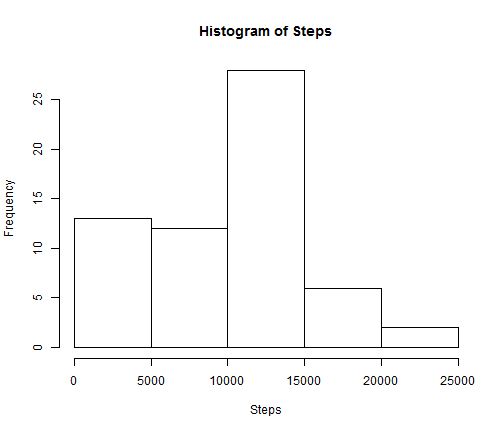
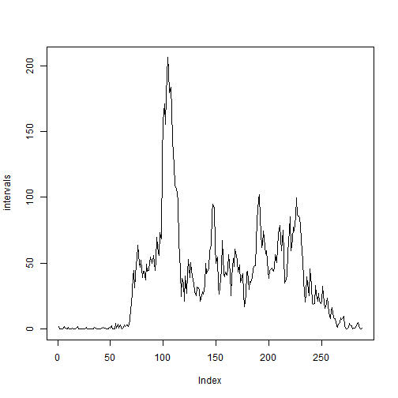
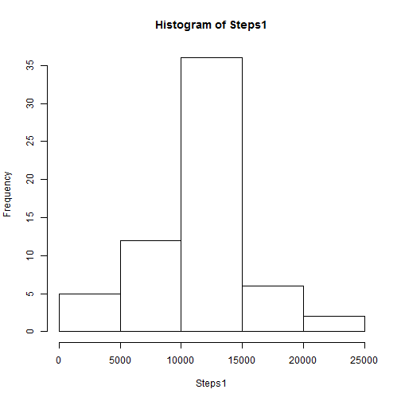
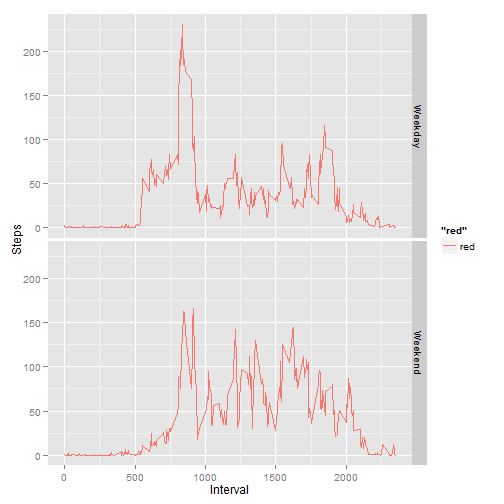

Jose L Apodaca Project 1
Reproducible Research
========================================================

## Loading and preprocessing the data (changing date fields to a date format):


```r

lecturas <- read.csv(unz("activity.zip", "activity.csv"))

lecturas$date <- as.Date(lecturas$date, "%Y-%m-%d")
```


## What is mean total number of steps taken per day?
### We first obtain the total steps per day and then produce a histogram:


```r
Steps <- tapply(lecturas$steps, lecturas$date, sum, na.rm = TRUE)
hist(Steps)
```

 


### And now the mean and the median for the data (still with some missing values):


```r
median(Steps)
```

```
## [1] 10395
```

```r
mean(Steps)
```

```
## [1] 9354
```


## What is the average daily activity pattern?

### The average pattern for every interval is shown as follows:


```r
intervals <- tapply(lecturas$steps, lecturas$interval, mean, na.rm = TRUE)
plot(intervals, type = "l")
```

 


### And the interval that on average shows the largest number of steps is:


```r
maxinterval <- intervals[which.max(intervals)]
print(maxinterval)
```

```
##   835 
## 206.2
```


## Imputing missing values

### We can see that the total number of NAs in the file is:


```r
nas <- sum(is.na(lecturas$steps))
print(nas)
```

```
## [1] 2304
```


### So we will impute the average value for that interval where NAs are found  
### and store it in a new dataframe:


```r
lecturas1 <- lecturas
index <- which(is.na(lecturas1$steps))

getmean <- function(x) {
    intervals[as.character(lecturas1$interval[x])]
}
toimpute <- as.vector(sapply(index, getmean))

lecturas1[index, "steps"] <- toimpute
```


### We can see the new histogram considering the imputed data:


```r
Steps1 <- tapply(lecturas1$steps, lecturas1$date, sum, na.rm = TRUE)
hist(Steps1)
```

 


```r
newmean <- mean(Steps1)
newmedian <- median(Steps1)
```


#### The new median is 1.0766 &times; 10<sup>4</sup> and also the new mean is 1.0766 &times; 10<sup>4</sup>


## Are there differences in activity patterns between weekdays and weekends?

### In order to see if a date is a weekday or a weekend we do the following:


```r
lecturas1$diasem <- weekdays(lecturas1$date)
tipodia <- function(x) {
    if (x %in% c("sábado", "domingo")) {
        "Weekend"
    } else {
        "Weekday"
    }
}
lecturas1$factor <- as.factor(sapply(lecturas1$diasem, tipodia))
```


### So we can compare the behavior of average steps per interaval for weekdays and weekends:


```r
library(ggplot2)
```

```
## Warning: package 'ggplot2' was built under R version 2.15.3
```

```r
p <- ggplot(lecturas1, aes(interval, steps)) + ylab("Steps") + xlab("Interval")
p + stat_summary(aes(color = "red"), fun.y = mean, geom = "line") + facet_grid(factor ~ 
    .)
```

 


### As we can see, weekends are more active during the noon and afternoon hours compared to weekdays.

